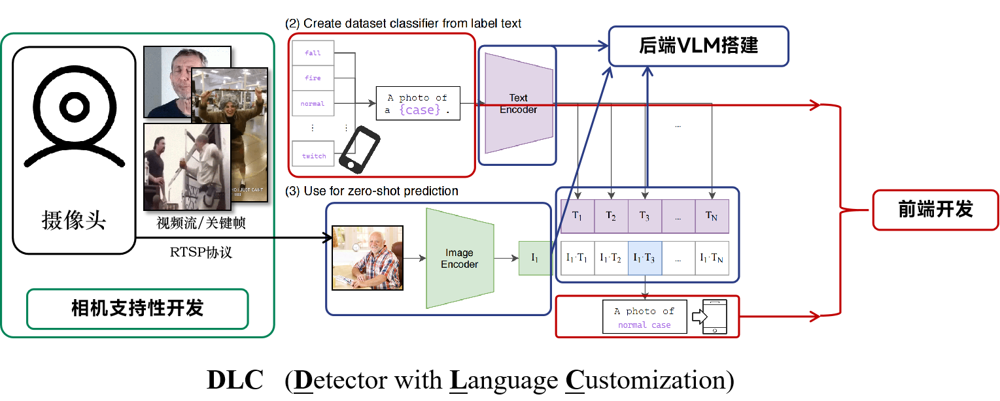

# DLC-Detector-with-Language-Customization

> Happy Programmer Day (10/24) !

这是我们 [工程学导论（ME1221）](https://oc.sjtu.edu.cn/courses/84663) 课程项目的版本管理仓库，本项目旨在实现一个基于CLIP的支持语义客制化的智能养老摄像头模块的硬件支持性开发、后端VLM开发以及前端开发。技术上，我们使用大规模语义预训练的CLIP模型，采用ViT作为视觉编码器，Vanilla Transformer作为语义编码器，zero-shot地进行场景识别，从而实现高度个性化的智能功能。



***

## 进度管理小清单

TODO：

- [x] 【1019前】实现infra
- [x] 【1023左右】写infra的文档
- [x] 【Throughout】咕咕咕呜呜呜哇哇哇
- [x] 【1023左右】技术对齐会议（课上）
- 【周度进度安排】1030课前
  - [ ] （**wty**）本周参考课件/建议书/课上说明购买：摄像头、摄像头架（预算300元左右，注意问老师报销规范，注意确保支持编程，尽量不要退货/重买），下周尽量带来课堂。
  - [ ] （**whk**）参考项目建议书进行背景等非技术部分的写作构思。
  - [ ] （**whk、wty**）假如有意愿进行开发，请按照本README文件的“第一步”“第二步”“第三步”进行环境配置与基础构建（关键节点：conda的完善、Copilot可以显示高级模型，创建自己的开发branch），从而支持后续的开发，在这个过程中如果遇到困难甚至感受到痛苦，不用勉强/坐牢，要是整个过程比较顺利，下周可以讨论各自负责的开发部分。我们的宗旨是***不要感受到坐牢**（非常真诚的），要是能开发当然欢迎，要是感觉太累了完全没必要硬撑。
  - [ ] （**lxr**）对于前端与GUI的实现进行初步尝试与技术调研，在下周形成比较明确的想法和设计思路。
  - [ ] （**jhy**）对于Pytorch、NLP、Vanilla Transformer进行回顾与熟悉，掌握项目Pipeline，构思相机支持性开发。
  - [ ] （**jyy**）尝试对现有的CLIP（ViT + Vanilla Transformer）实现进行进一步厘清，完善现有的接口和注册，支持两端的开发。
- [ ] [视频捕获模块](src/core/video_capture.py) → 调用detector.detect(frame)
- [ ] [警报管理器](src/core/alert_manager.py) → 接收result字典
- [ ] [主程序](main.py) → 整合所有模块


## 写在前面：环境配置与基础构建

### 第一步：构建VSCode与Python (Conda)开发环境

请参考[课件](./doc_asset/doc/Python的安装与使用.pptx)完成环境（VSCode + Python（Conda））的配置，若中途遇到问题（比如和C++的编译器发生奇怪的冲突），建议不要着急，描述清楚问题后询问AI。此处感谢[魏煊老师](https://www.acem.sjtu.edu.cn/faculty/weixuan.html)的课程课件，请仅用于参考，勿进行二次传播。

有关python语法，我相信开发相关同学不需要太多学习，若有需要，可以参考[官方文档](https://docs.python.org/zh-cn/3/)以及[菜鸟教程](https://www.runoob.com/python3/python3-tutorial.html)。

### 第二步：完成Github学生认证并开始使用

请参考[这个教程](https://zhuanlan.zhihu.com/p/688730361)完成Github学生认证，之后就会获得Github Copilot的免费使用资格。看起来有些麻烦，但是做完之后能够长久提高你的coding生产力，AI写代码确实是很高效的。值得注意的是，申请很可能不能一遍过，可以针对性再上网搜索不过的原因（比如针对“你为什么不在学校”的问题需要用浏览器功能改定位经纬度之类），相信你遇到的问题总有人遇到过并写过分享。要是实在不行可以在[水源社区有关帖子](https://shuiyuan.sjtu.edu.cn/t/topic/405088)下礼貌询问。

在获得学生权益包之后，就可以在VSCode中下载copilot相关插件，并且开始使用代理模式生成啦。有关可能遇到的Claude不对中国IP开放的问题，可以参考[这个帖子](https://www.xiaohongshu.com/explore/68d10aca000000000b03dcc2?app_platform=android&ignoreEngage=true&app_version=9.3.0&share_from_user_hidden=true&xsec_source=app_share&type=normal&xsec_token=CBCVGWu2SEszJUjiL-Lm3k5EuMaxULXqDBvZOYVc2o-mY=&author_share=1&xhsshare=WeixinSession&shareRedId=ODw5NTc6Oko2NzUyOTgwNjY2OTo3PkdA&apptime=1760021884&share_id=b95fbc0175974ad986e575235df49c27&share_channel=wechat)。有关工程问题，我建议使用Claude Sonnet 4.5，试验下有最好的工程代码表现。

### 第三步：学习Git和Github的使用方法

因为版本管理是码类学生绝对逃不开的一个重要软实力，**建议花一个下午的时间沉下心来学习[这个教程](https://www.runoob.com/git/git-tutorial.html)**，并且跟着敲一遍，之后就可以直接使用，不会的时候问AI了。

比如，在我现在在做的另一个项目需要版本管理，但是我不记得一些操作指令的时候，可以这样问AI（但是你必须清楚你在干什么）：

```
我现在在服务器上的`robust_dev`分支进行操作，需要将在codeup管理的`dev`这个默认分支的内容合并到现在的分支，但是我现在的分支有5 commits领先于默认分支，8 commits落后于默认分支，也就是存在我想要保留的差异，但是又有需要更新的。此外，我的第一个子分支的第一个commit放进了不需要上传codeup的、里面存在实际文件和软链接的assets文件夹，我希望在同步前将其移出来，同步后再放回去，我应该怎么操作？
```

当你认为自己学会了Git/Github的基本操作时，请在项目群里进行说明，并且给出你的Github账户，我们将会邀请你加入项目，并且给你一定的修改权限。在此之后，**请你在`main`分支的基础上创建`[姓名首字母缩写]_dev`（例如`jyy_dev`）表示这是你的开发分支**。在后续的开发中，我们的开发模式是，每位同学在自己的分支上进行开发，适时和`main`分支保持同步（即从`main`拉取更新），在你完成某个功能的实现后，请你先同步到自己的开发分支上，然后发起pull request，我（金抑扬）将会审核后合并入`main`分支。同时，请你在完成自己的开发部分后对于[README文件](./README.md)进行更新，说明你的实现的一些相关介绍、重要接口、其他开发同学应该如何使用你的最新实现，等等等等。

值得注意的是，假如有一些实际上并不需要使用git跟踪上传的文件，可以参考[.gitignore的写法](https://liaoxuefeng.com/books/git/customize/ignore/index.html)里面的教程，比如你录制了一个一个G的视频，你肯定不需要上传它，假如其在`assets/`文件夹下，就可以考虑把这个文件夹一整个`ignore`掉。

最后，感谢你对于DLC项目的兴趣！我们真诚希望大家能够和平度过这门金课——**不坐牢、有成长、喜交朋**。

***

## \[JYY\] 项目 Infra 介绍

首先，我（金抑扬）会在分配任务前完成代码的框架，下面是对于文件结构、代码功能的介绍。下面的东西是**需要仔细看的**，在看完之后，可以把`main`分支的这个infra `merge`到**你的开发分支**，并且在本地读一读确切的文件结构、 代码框架。一些操作上、器物上的说明，可以参看[我准备的环境具体配置文档（建议conda，有问题随时群里问）](./docs/QUICK_REFERENCE.md)——要是这个过程让你极度痛苦，同样可以考虑转非开发角色——但是这个过程还是必要的，尤其对于后续的课程和科研而言（但是对大一来说确实太早，真诚不推荐很早进组——哎呀说开去了，总之下面的东西请好好读~）。

### 1. 项目概述

#### 1.1 核心功能

**基础功能**：
- ✅ 实时视频流读取与关键帧提取
- ✅ 基于CLIP的语义客制化事件检测
- ✅ 警报信息输出

**拓展功能**：
- 🔄 短信API警报通知
- 🔄 隐私保护（视觉掩码）
- 🔄 GUI前端界面
- 🔄 场景迁移测试

#### 1.2 输入源支持

项目需要支持两类输入源，均存放在 `assets/` 文件夹下：

1. **实时视频流** (`assets/rtsp_streams/`)
   - 从海康威视相机模块读取RTSP协议流
   - 支持不同分辨率（如720p, 1080p等）
   - 实时抽取关键帧进行处理

2. **离线视频文件** (`assets/test_videos/`)
   - 预先录制的测试视频（mp4, avi等格式）
   - 用于功能测试和效果展示
   - 按固定帧率或场景变化抽取关键帧

---

### 2. 文件结构说明

```
DLC-Detector-with-Language-Customization/
│
├── assets/                          # 输入资源目录
│   ├── rtsp_streams/               # RTSP实时流配置
│   │   ├── stream_configs.json    # 流地址和参数配置
│   │   └── README.md              # RTSP流使用说明
│   └── test_videos/               # 测试视频文件
│       ├── fall_detection/        # 跌倒检测测试视频
│       ├── fire_detection/        # 火灾检测测试视频
│       └── normal_scenarios/      # 正常场景视频
│
├── config/                         # 配置文件目录
│   ├── camera_config.yaml         # 相机参数配置
│   ├── model_config.yaml          # CLIP模型配置
│   └── detection_config.yaml      # 检测阈值和场景配置
│
├── data/                          # 数据目录
│   ├── logs/                      # 运行日志
│   ├── models/                    # 预训练模型存放
│   │   └── clip/                 # CLIP模型权重
│   └── outputs/                   # 输出结果
│       ├── alerts/               # 警报记录
│       └── frames/               # 提取的关键帧
│
├── src/                           # 源代码目录
│   ├── __init__.py
│   │
│   ├── core/                      # 核心功能模块
│   │   ├── __init__.py
│   │   ├── video_capture.py      # 视频捕获和关键帧提取
│   │   ├── clip_detector.py      # CLIP模型检测器
│   │   └── alert_manager.py      # 警报管理器
│   │
│   ├── models/                    # 模型相关
│   │   ├── __init__.py
│   │   ├── clip_wrapper.py       # CLIP模型封装
│   │   └── vision_encoder.py     # 视觉编码器
│   │
│   ├── utils/                     # 工具函数
│   │   ├── __init__.py
│   │   ├── image_processing.py   # 图像预处理
│   │   ├── config_loader.py      # 配置加载器
│   │   └── logger.py             # 日志工具
│   │
│   └── alert/                     # 警报功能（拓展）
│       ├── __init__.py
│       ├── sms_sender.py         # 短信发送
│       └── notification.py        # 通知管理
│
├── scripts/                       # 脚本目录
│   ├── download_models.py        # 下载预训练模型
│   ├── test_camera.py            # 测试相机连接
│   └── run_demo.py               # 运行演示
│
├── tests/                         # 测试代码
│   ├── test_video_capture.py    # 视频捕获测试
│   ├── test_clip_detector.py    # 检测器测试
│   └── test_integration.py       # 集成测试
│
├── gui/                           # GUI界面（拓展）
│   ├── __init__.py
│   ├── main_window.py            # 主窗口
│   └── settings_panel.py         # 设置面板
│
├── docs/                          # 文档目录
│   ├── API.md                    # API文档
│   └── USER_GUIDE.md             # 用户指南
│
├── requirements.txt               # Python依赖
├── main.py                        # 主程序入口
└── README.md                      # 项目说明
```

### 3. 技术实现方案

#### 3.1 视频捕获与关键帧提取

**输入源处理**：

```python
# 伪代码示意
class VideoCapture:
    def __init__(self, source_type, source_path):
        """
        source_type: 'rtsp' 或 'video'
        source_path: RTSP URL 或 视频文件路径
        """
        pass
    
    def get_frame(self):
        """获取下一帧"""
        pass
    
    def extract_keyframes(self, method='interval'):
        """
        提取关键帧
        method: 'interval' (固定间隔) 或 'scene' (场景变化)
        """
        pass
```

**关键帧提取策略**：

1. **固定间隔法**（优先实现）
   - 每隔N帧提取一帧（N可配置，建议30-60）
   - 优点：简单高效
   - 缺点：可能错过短暂事件

2. **场景变化检测法**（可选优化，怪复杂的，我（金抑扬）不是很建议）
   - 计算相邻帧的差异（如直方图差异）
   - 超过阈值则认为场景变化，提取关键帧
   - 优点：更智能，不会遗漏重要时刻
   - 缺点：计算量稍大

---

#### 3.2 CLIP模型集成

**模型选择**：
- **OpenAI CLIP**: `openai/clip-vit-base-patch32`
- **OpenCLIP**: `laion/CLIP-ViT-B-32-laion2B-s34B-b79K` (更大规模预训练)

**快速了解原理**：

- [快速了解Transformer（但是视频中有一处错误）](https://www.bilibili.com/video/BV1dyW9zsEk1?vd_source=fea757cded14707bcd60c2e78d0c58ba)
- [稍微慢速一点了解Transformer](https://www.bilibili.com/video/BV1xoJwzDESD?vd_source=fea757cded14707bcd60c2e78d0c58ba)
- [快速了解ViT及其在VLM中的作用](https://www.bilibili.com/video/BV1gnWdzSEzY?spm_id_from=333.788.recommend_more_video.0&trackid=web_related_0.router-related-2206146-5nk2d.1761735178765.390&vd_source=d6c101018355a1105cd81c932cad93c4)
- [再稍微慢速一点了解Transformer（9个视频）](https://www.youtube.com/watch?v=aircAruvnKk&list=PLZHQObOWTQDNU6R1_67000Dx_ZCJB-3pi)

更详细的了解建议学习《动手学深度学习》全书（以及一些更加前置的教程）后去读原论文，预计需要三个月到一年的课余时间，不用着急，这并不适合本课程项目的进度设置。这里只是进行一些陈列，以飨感到好奇的同学。

**检测流程**：

```python
# 伪代码示意
class CLIPDetector:
    def __init__(self, model_name):
        self.model = load_clip_model(model_name)
        self.processor = load_clip_processor()
    
    def detect(self, image, text_prompts, threshold=0.25):
        """
        image: PIL Image 或 numpy array
        text_prompts: List[str], 如 ["a person falling down", "a fire"]
        threshold: 相似度阈值
        
        返回: Dict[str, float] - {场景: 相似度分数}
        """
        # 1. 图像编码
        image_features = self.encode_image(image)
        
        # 2. 文本编码
        text_features = self.encode_text(text_prompts)
        
        # 3. 计算余弦相似度
        similarities = cosine_similarity(image_features, text_features)
        
        # 4. 判断是否超过阈值
        results = {}
        for i, prompt in enumerate(text_prompts):
            if similarities[i] > threshold:
                results[prompt] = similarities[i]
        
        return results
```

**文本提示词设计**：

| 场景 | 英文提示词 | 中文提示词（参考） |
|------|-----------|-------------------|
| 跌倒 | "a person falling down", "an elderly person fallen on the ground" | 一个人摔倒了，老人倒在地上 |
| 火灾 | "fire in a room", "flames and smoke" | 房间里着火了，火焰和烟雾 |
| 水淹 | "floor covered with water", "flooding indoors" | 地板被水覆盖，室内淹水 |
| 正常 | "a person standing normally", "everyday home scene" | 人正常站立，日常家庭场景 |

**优化技巧**：
- 使用多个相似提示词取平均值，提高鲁棒性
- 引入"正常场景"作为对照，使用对比分数判断异常

---

#### 3.3 警报管理

**警报策略**：

```python
class AlertManager:
    def __init__(self, config):
        self.thresholds = config['thresholds']
        self.alert_history = []
        self.cooldown_time = 30  # 冷却时间（秒）
    
    def should_alert(self, detection_results):
        """
        避免重复警报：
        - 同一场景在冷却时间内不重复警报
        - 连续N帧检测到才触发（可选）
        """
        pass
    
    def trigger_alert(self, scene, confidence):
        """
        触发警报：
        - 打印到终端
        - 记录到日志
        - 发送短信（如果启用）
        """
        pass
```

---

#### 3.4 配置文件设计

**`config/detection_config.yaml`**:

```yaml
detection:
  # 检测场景配置
  scenarios:
    fall:
      enabled: true
      prompts:
        - "a person falling down"
        - "an elderly person fallen on the ground"
      threshold: 0.25
      cooldown: 30  # 秒
    
    fire:
      enabled: true
      prompts:
        - "fire in a room"
        - "flames and smoke"
      threshold: 0.30
      cooldown: 60
  
  # 关键帧提取
  keyframe:
    method: "interval"  # interval 或 scene
    interval: 30  # 每30帧提取一次
    scene_threshold: 0.3  # 场景变化阈值

# 警报配置
alert:
  print_to_console: true
  save_to_log: true
  sms_enabled: false  # 拓展功能
  sms_contacts:
    - "+86138XXXXXXXX"
```
### 4. 开发与使用规范

#### 4.1 代码规范

- **编码标准**: PEP 8
- **命名规范**:
  - 类名: `PascalCase`
  - 函数/变量: `snake_case`
  - 常量: `UPPER_CASE`
- **注释要求**:
  - 每个函数必须有docstring
  - 复杂逻辑必须有行内注释
- **类型提示**: 推荐使用Python类型注解

#### 4.2 预想中的快速开始（显然现在还没有实现完，开始不了一点）

##### 4.2.1 环境搭建

```bash
# 1. 克隆仓库
git clone <repo-url>
cd DLC-Detector-with-Language-Customization

# 2. 创建虚拟环境
python -m venv venv
source venv/bin/activate  # Linux/Mac
# venv\Scripts\activate  # Windows

# 3. 安装依赖
pip install -r requirements.txt

# 4. 下载CLIP模型
python scripts/download_models.py
```

##### 4.2.2 运行测试

```bash
# 测试相机连接
python scripts/test_camera.py

# 运行demo
python scripts/run_demo.py --source video --path assets/test_videos/fall_detection/test1.mp4
```

##### 4.2.3 运行主程序

```bash
# 使用RTSP流
python main.py --source rtsp --config config/detection_config.yaml

# 使用测试视频
python main.py --source video --path assets/test_videos/fall_detection/test1.mp4
```

---

- 一些小小的教程
  - CLIP实践教程: https://huggingface.co/docs/transformers/model_doc/clip
  - OpenCV视频处理: https://docs.opencv.org/4.x/dd/d43/tutorial_py_video_display.html


